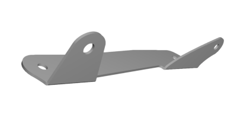

# 86BUTTDROP

86BUTTDROP is my attempt at gaining headroom on the "gen2" Subaru BRZ and Toyota GR86 cars by lowering the stock seat.

After multiple iterations, I settled on a design that lowers the seat by about 18 mm, which provides a very
noticable increase in headroom. It might be possible to modify the parts to lower the seat a bit further,
but will require cutting OEM parts, so I've decided to not do it for now.

There are multiple versions of the kit available to achieve different amount legroom. More on that below.

Here's how one of the versions looks like:


And how the seat looks like with the kit installed:


The GIF below demonstrates how low the seat can go with this kit compared to the OEM raisl. The light
is coming from a flashlight positioned behind the seat, and is obstructed by the plastic panel on the
side of the seat. With the seat on OEM rails in the lowest position, that plastic panel is about 19 mm
above the floor, but with the lowering kit the gap is completely eliminated. Note that this GIF was
recorded with an earlier prototype that had ~20 mm lowering; I have since reduced the amount of
lowering by 2 mm to avoid contact between the plastic panel and the floor that could cause squeaks.


## License

I'm publishing what I created under the following license:
```
86BUTTDROP by Timur Iskhodzhanov is marked with CC0 1.0 Universal.
To view a copy of this license, visit https://creativecommons.org/publicdomain/zero/1.0/
```

In particular, I'd like to call out that I make no warranties about the work, and disclaim liability for
all uses of the work, to the fullest extent permitted by applicable law.\
**I'm not a mechanical engineer, I'm practically just a random dude on the internet. While I tried my best,
I can't make any promises about the safety/strength/etc. of this design. No crash testing or finite element
analysis has been performed for this kit. Use at your own risk!**

That being said, if you get in an accident with this kit installed in the car, I'd really appreciate it
if you [share](https://github.com/timurrrr/86buttdrop/issues/new) the resuls with the community,
such as whether any parts or hardware fail, if the side airbag deploys, etc.

If someone can help with a FEA analysis or crash testing for this kit that would be amazing!

## Support the project

I've spent over $750 on multiple iterations of prototype parts (not including the cost of my own kit!),
and countless hours pulling the seat out, measuring things, testing fitment, and putting the seat back
in back in... I also had to go to a chiropractor a few times \:)

While I'm sharing the results with you for free, I would really appreciate donations to help me offset
the costs, and motivate me to work on more projects like this in the future.

Here's a convenient button you can use to donate via PayPal:

[](https://www.paypal.com/donate?business=ZKULAWZFJKCES&item_name=Donation+to+support+the+86BUTTDROP+project+on+GitHub&currency_code=USD)

## Overview

The kit consists of three metal brackets bolted together, to the factory seat, and to the floor.

The kit replaces the factory seat slider mechanism, so you will need to use different parts depending
on the amount of legroom you need. The seat will retain the height adjustment mechanism, and moves the
seat a bit forward as it raises it, so if you share the car with someone within an inch or two from you,
you might be able to adjust the legroom down a bit for the shorter person.

To figure out which kit you need, set up the seat as you normally drive, then use
a millimeter tape measure or a ruler, and measure how much space there is
between the the front of the stock slider and the front edge of the stock rail
on the door side of the seat. See picture:


Double-check that you're measuring the right thing, as sometimes the level for
the sliders gets in the way of the L-shaped end of the tape measure. The factory
rail moves in 10 mm steps, so you should get something like 50 mm, 60 mm, 70 mm,
80 mm, 90 mm or 100 mm (max). This measurement is the number I'm going to refer
to as "legroom" throughout the rest of the instructions.

"Legroom", mm | Links | Notes
----------------- | ------------- | -----
<50 | TBD | Haven't tried yet, but looks doable. Will require a slightly different design for side brackets.
50-60 | TBD | Should be easy to make, see the difference between the 70 and 80 kits.
70 | [Download .ZIP](https://github.com/timurrrr/86buttdrop/raw/main/kits/86buttdrop_70.zip) | An earlier revision was verified.
80 | [Download .ZIP](https://github.com/timurrrr/86buttdrop/raw/main/kits/86buttdrop_80.zip) | Verified!
90 | --- | Will not be offered due to geometric challenges. Use the 80 or 100 kit instead.
100 | TBD | Requires a different layout than 50-80, work in progress.

## Ordering the parts from SendCutSend

Download the ZIP file for the desired "legroom" from the table above and unzip it.

Go to https://sendcutsend.com/ (SCS) and create an account.

Upload each `.eps` file from the unzipped folder int SCS one by one, performing the following steps:

### Door side and transmission side L brackets

1. Confirm "Inches" as measurement units (I don't know why SCS thinks it's inches as I made the design in mm, but whatever).
1. Use "Metals > Steel > A36/1008 Mild steel > **3** mm CRS".
1. On the "Add services" page, set both bends to 90 degrees **UP**.
1. On the "Add finishing" page, choose "Powder coating > Matte black".

Here's how the parts should look like in the 3D preview mode:\
(the exact geometry will depend on which "legroom" you chose)




### Floor bracket

1. Use "Metals > Steel > A36/1008 Mild steel > **3.4** mm CRS".
2. On the "Add services" page, make
  * the two bends at the front of the bracket **5** degrees **DOWN**,
  * the bend at the top of the seatbelt tab **35** degrees **UP**,
  * and at the bottom of the seatbelt tab **55** degrees **UP**.
  * Tip: when you choose which bend line to enter the degrees for, it should
    highlight the bend in the 2D/3D preview.
    
3. On the "Add finishing" page, choose "Powder coating > Matte black" (send me photos if you decide to add a splash of color!)

Here's how the part should look like in the 3D preview mode:\
(the exact geometry will depend on which "legroom" you chose)


### Seatbelt bolt sleeve

1. Use "Metals > Steel > 4130 Chromoly > 4.8 mm".
1. No services, no finishing.

### Placing the order

* Add one of each part to your Cart (you should have four items in total).
* Verify the quote, it should be about $200.
* Order when ready!

## Additional hardware

You will need:

* 4x Class 10.9 M10x1.25 _flange_ bolts, 25 mm thread length.
  * We will use them to bolt the kit to the floor, so it's important to use the right length.
* Class 10.9 M10x1.25 _flange_ bolts, 20 mm thread length.
  * For the 100 mm legroom option, you'll need 6 of them.
  * For other legroom options, you'll only need 4.
  * It's OK to use slightly longer bolts for this item, e.g. same 25 mm size as mentioned above.
* Class 10.9 M10x1.25 _flange_ nuts.
  * For the 100 mm legroom option, you'll need 7 of them.
  * For other legroom options, you'll only need 5.
* 1x Grade 8 7/16"-20 bolt, 3/4" thread length.

I got all of these at a local ACE Hardware store for ~$50.

## Installation instructions

**Warning: these instructions are incomplete.**

TODO: Walk through the installation instructions again with a new user, take photos and add here.

Tools required:

* Metric sockets and wrenches
* Breaker bar
* T50 L-shaped wrench, or better yet T50 bit with a low profile wrench
* Optional: Blue loctite
* Optional: Tesa 51608 tape or similar.

### Removing the seat from the car, and the OEM sliders from the seat

1. Fully lower the window in the driver side door.
1. Disconnect the battery. We'll be dealing with an airbag harness and don't want surprises.
1. Press and hold the brake pedal for a second or two to make sure everything is discharged.
1. Move the steering wheel all the way forward and up, cover it with a towel or a rag.
1. Move the back of the seat all the way forward, pull out the headrest.
1. Move the seat all the way back.
1. Raise the seat all the way up.
1. Detach the cloth flap under the front of the seat from the metal frame of the seat.
1. Detach the conduit for the wires from the metal tab on the seat.
1. Disconnect the harnesses from the seat.
   * This can be a little tricky, but take your time. If you get it right, you won't need to apply much force to pull things out.
1. Using a 12 mm socket and a breaker bar, slightly loosen the four bolts that attach the seat to the floor.
   * You'll need to slide the seat forward to access the rear bolts.
1. Once all four bolts are loose, remove the four bolts. You will not reuse them for this kit, but you may want to keep them in case you ever decide to put the factory sliders.
1. Put another towel over the door jamb.
1. Prepare a bench, moving box, or something like that to put the seat.
1. Carefully pull the seat out of the car, flip it so that the back of the seat back faces down, and set it on the bench / moving box / etc.
1. Pull the plastic covers at the back of the stock rails off the rails.
   * They are super-fragile, so be careful. I've seen cars when they were already broken even before the removal.
   * Optional: cut the covers off the plastic part that attaches them to the back of the seat, and pull those C-attachments out of the seat.
1. Using a 14 mm wrench, remove the nut attaching the seatbelt tab to the seat, and the spring washer. Carefully put the tab into the seat.
1. Use the height adjustment mechanism to "raise" the seat off the rail all the way.
1. Using a T50 wrench, remove the two rear bolts that attach the rail slider to the seat.
1. Turn the bar that attaches the rail to the front of the seat out of the seat to gain better access to the bolts.
1. Remove the front two bolts that attach the rail slider to the seat.

### Installing the kit onto the seat

1. Attach the transmission side and door side brackets to the seat using the same two front bolts in the same positions.
   * Consider using blue loctite on the threads.
1. Turn the bar back into the seat, and install the rear bolts.
   * Use one of the M10 flange nuts to hold the bolt under the height adjustment mechanism.
1. Tigthen all four bolts to ~20 ft•lbs.
1. Optional: Cover the bottom edges of the transmission side and door side brackets with tape to reduce squeaks.
1. Using pliers or a crescent wrench, bend the metal tab near the transmission side front bolts out of the way.
   * TODO: add photos.
1. Relocate the wires under the seat to avoid the lowest area of the seat to prevent crushing them against the floor.
   * TODO: add photos.
1. On the floor bracket, break off the C-shaped metal part around where the seatbelt buckle will go and discard.
   * Optional: cut/file the remaining "bridges" that stick out.
1. Using two 20 mm M10 flange bolts, hang the floor bracket onto the side brackets, pointing the tips of the bolts toward the seat.
1. Put the other bolts through the floor bracket and the side brackets. Again, the tips should point at the seat.
   * For the 100 legroom option, you'll need to use 6 bolts, otherwise 4.
1. Put M10 flange nuts onto the bolts, but don't tighten them yet.
1. Use the height adjustment mechanism to "lower" the seat all the way.
1. Shake the floor bracket relative to the side brackets to make sure there's no binding.
1. Loosely tigthen these 4 or 6 bolts.
1. Re-tighten all those 4 or 6 bolts to 50 ft•lbs.
1. "Raise" the seat all the way again, put the 7/16" bolt through the seatbelt tab attachment hole.
   * You might need to use a 16 mm wrench to force the bolt through the hole.
1. Put the sleeve you ordered through SCS on top of the bolt, and the OEM spring washer.
1. Put the seatbelt tab on to of all that, and secure it with the OEM nut.
1. Tigthen the seatbelt tab bolt to 30+ ft•lbs.
1. "Lower" the seat again.

### Installing the seat into the car

1. Carefully put the seat back into the car, and roughly align it with the holes on the floor.
1. Raise the seat all the way up.
1. Using M10 flange bolts (not the OEM bolts!), attach the kit to the floor.
   * Make sure you don't cross-thread anything!
   * Don't fully thread the bolts yet. Only use finger-level of torque on them.
   * If any of the bolts require more torque than amounts achievable by fingers, try to take the bolt
     out, and check/clean the threads. Maybe try a different bolt.
   * The holes around the bolts will be a bit tight, so figure out what works best for you. Try starting
     from the rear bolts to have more flexibility. If you can't find the right position, try putting the
     front bolts first to get the bracket roughly where it should be.
   * For the 100 mm "legroom" kit, the transmission side rear bolt will require some patience, and a bit
     of hand mobility. Once the bolt is roughly in place, you should be able to use your index finger and
     thumb around the post/tab of the transmission side bracket next to that bolt.
   * For the 80 mm "legroom" kit, you might need to carefully pull the seat off the floor a little bit
     in order to put the bolt in the right position. Be careful and take your time to make sure that the
     bolt "grabs" the threads on the floor. You might need a helper to hold the seat slightly off the floor.
1. Once all four floor bolts are started, hand-tigthen them all.
1. Using a 14 mm wrench, tighten the floor bolts.
1. Lower the seat all the way, checking for clearance issues.
   * For kits with "legroom" less than 70 mm, you might need to bend the tab that held the conduit for the electric
     harnesses a bit towards the rear of the car.
1. Ask a helper to sit in the seat, while looking under the seat with a flashlight.
1. Ask the helper to bounce up and down in the seat a bit, and make sure that no wiring is getting crushed between
   the seat and the floor. Take a moment to appreciate how low the seat is now!
1. In case of any clearance issues, take the seat out of the car, and adjust as needed.
   * [Let me know](https://github.com/timurrrr/86buttdrop/issues/new) what issues you run into and how you worked around,
     so that I can update the documentation.
1. If everything looks good, reconnect the harnesses, attach the conduit and the cloth flap to the front of the seat.
1. Put the headrest back.
1. Adjust the seat to your liking.
1. You will likely need to re-adjust the mirrors.
1. Enjoy! (and consider [donating](#support-the-project))

## FAQ

### Why did you make this?

I'm a 6'4" guy who regularly goes to track days in my GR86 and I didn't have enough headroom to sit comfortably.
My neck and upper back were always sore the next day after a track day, and thanks to the extra headroom I no
longer need to suffer as much.

### How much does it cost?

You should expect ~$200 for parts from SCS, and ~$50 for quality hardware from your nearby hardware store.\
This is comparable to the price of a seat bracket for a bucket seat WITHOUT the bucket seat!

Consider [donating](#support-the-project) to help me offset the R&D costs for this project.

### Does it require any modifications to the stock parts?

Yes, but should be minor.

All "legroom" options require bending one non-functional tab on the bottom of the seat that is out of the view.
Some wires need to be relocated, but that's reversible. The plastic covers for the rear ends of the factory
rails need to be removed and can break (very brittle plastic), but they don't matter that much, especially
if nobody can fit behind you anyway.

Some "legroom" options might require additional mostly-reversible bending of the parts underneath the seat.

No drilling or cutting of stock parts is required.

### Does the kit "just work"?

I tried my best, but you might need to drill or file a few mm here and there if I messed something up.
SendCutSend can mess something up too, so if some parts don't seem to fit, please compare them against the
files you send to them. They messed up one of my orders badly, but to their credit they made new parts for
me for free.

### Can I adjust the legroom with this kit?

You lose the factory sliders. There's a little bit of legroom adjustability from the height adjustment mechanism,
but not nearly as much as the stock seat has with sliders.

### Can I still haul tires in the back seat?

I hauled 4x 245/40R17 tires in my car with this kit. As long as you load stuff through the passenger seat,
you shouldn't notice any difference from the stock seat in your normal driving position from the perspective
of carrying stuff in the rear seat.

That being said, on some very rare occasions I need just a few more inches to fit something on the rear seats.
With the stock rails I could move the seat forward more than usual for a short drive, but can't gain more than
an inch or so with the lowering kit.

### Was this crash tested?

NO! See the [License](#license) section above.

### Does it retain the factory side airbag?

Yes, with caveats.

Yes in the sense that you still have the stock seat that still has an airbag and it's still connected to the car.\
The caveat is that the seat is ~18 mm lower than the stock seat can physically go, which means the position of the
airbag is outsie the range it was designed to operate. (I'm personally skeptical that a helmet pressed into the
ceiling in one's normal is within the operating range of the safety systems in the car either...)

Once again, no crash testing has been performed for this kit. See the [License](#License) section above.

### Will it work on a 1st gen BRZ / FR-S / 86?

Not with the stock seats. It should work with gen2 seats in a gen1 car, but I haven't verified that yet.\
I don't know if the side airbag in gen2 seats is compatible with gen1 cars.

### Can it work for the passenger seat?

Maybe, I haven't tried. The passenger seat doesn't have the height adjustment mechanism, so it would be a pain
to install this kit. Furthermore, it would compromise the convenience of loading stuff onto the back seat, such
as spare tires.

## Acknowledgments

I'd like to thank Jerrit Erickson for his enormous help with the early prototypes and sanity checking me
along the way, and Ed Runnion for testing an early prototype, providing feedback and rave reviews on Facebook :)
